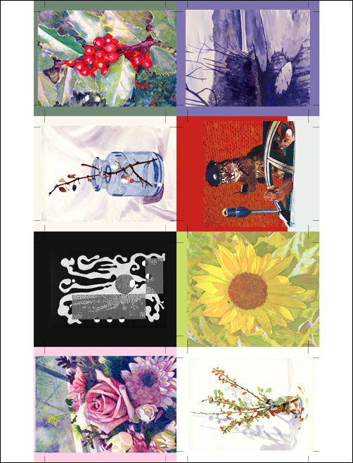
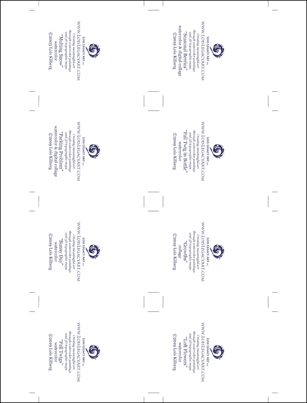

Creating a Photoshop File for Notebook Front Covers
###################################################

About our Small Spiral Notebooks
================================

.. index:: main documentation

At |llc|, we create a large variety of small notebooks. We place our fine art reproductions, illustrations, and map prints on the front covers.  This document describes in detail how to layout a Photoshop file to print multiple front covers for a certain size of notebooks. It is one step in the process of creating notebooks. You can learn more about creating spiral notebooks at: |mainDocNotebooks|. To request information about the availability of these notebooks, email |emailInfoLLC|.

The steps in this document are also covered in this video:

.. index:: video

|video|

.. index:: specifications for notebook

Spiral Notebook Specifications
==============================

This document describes the multiple cover layout for #2 |szNm2| notebooks that have a trim size of |szTrimShort2| x |szTrimLong2|. We assume a bleed of 1/4" all around. The orientation is for *vertical* images, and the wire spiral placement is at the *top*.

Please note that the steps to create the front cover layout are the same whether the notebook thickness is |Thin| or |Chunky|.

Requirements
============

.. index:: Photoshop, light source

* Computer running Photoshop (we are using Adobe Creative Suite CS4 for Windows 10)
* Individual files for the images, already laid out
* Individual files for the information inside, already laid out
* Printer that you will use to create the front covers
* Regular paper, at least one sheet but maybe more if adjustments are needed
* Strong light source in a darkened room, for checking the test printout

Steps:
======
.. toctree::
   :maxdepth: 1

   01_settingUpPhotoshop.rst
   02_layingOutMultipleCovers.rst
   03_testPrinting.rst
   04_nextSteps.rst

.. add new files to list above to include them in toc
