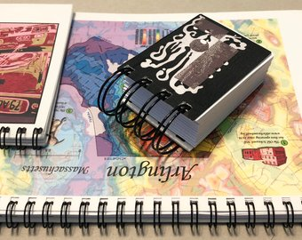

Creating a Photoshop File for Notebook Front Covers
###################################################

Introducing Small Spiral Notebooks
==================================

At |llc|, we create a large variety of small notebooks. We place our fine art reproductions and map prints on the front covers. These notebooks are very portable to take along with you, which makes it fun and easy to write notes almost anywhere! The wire spiral allows you to have a flat surface to write on without taking up extra space. The heavy matboard backing strongly supports your writing or drawing. The inner pages are made from paper which is easy to draw on and is acid-free.

We are calling them small notebooks in this document because most of the sizes are smaller than a standard 8.5" x 11" paper, although we do offer the standard size as well.

There are a variety of ways to make notebooks. This document will describe how we are currently making them at |lla|. By reading this document, perhaps you are interested in how we make our notebooks. Or, perhaps you are actually assisting |llc| to create the notebooks and want to learn the process.

To request information about the availability of these notebooks, email |emailInfoLLC|.

Why Make Our Own Small Spiral Notebooks?
========================================

While there are other commercially available small spiral notebooks at stores, when you receive them from |lla|:

* You will get unique artistic images on the covers that are not available anywhere else.
* You will commission special images to be placed on the covers.
* We make them in sizes and styles that may not be easy to find at other places.
* You support local artists by buying them from |lla|.

Choosing Sizes and Styles
=========================

|lla| makes the following sizes and styles of spiral notebooks:

.. list-table::
   :widths: 20 30 25 25
   :header-rows: 1

   * - #
     - Size
     - Short Side
     - Long Side
   * - #1
     - |szNm1|
     - |szTrimShort1|
     - |szTrimLong1|
   * - #2
     - |szNm2|
     - |szTrimShort2|
     - |szTrimLong2|
   * - #3
     - |szNm3|
     - |szTrimShort3|
     - |szTrimLong3|
   * - #4
     - |szNm4|
     - |szTrimShort4|
     - |szTrimLong4|
   * - #5
     - |szNm5|
     - |szTrimShort5|
     - |szTrimLong5|
   * - #6
     - |szNm6|
     - |szTrimShort6|
     - |szTrimLong6|

Notebooks come in two thicknesses:

* |Thin| notebooks have approximately |thinPgs| sheets.
* |Chunky| notebooks have approximately |chunkyPgs| sheets.

Additional Style Choices:

* The **orientation** of the image on front can be *vertical* or *horizontal*.
* The **wire spirals** can be placed either on the *top* or on the *left* side.

Steps to Create Small Spiral Notebooks
######################################
We typically use the plural term "notebooks" in this document. That is because you can often fit more than one smaller notebook on a regular sized sheet of paper, making it efficient to make more than one notebook at a time. However, you can also follow the steps to make just a single notebook. 

You can follow all the steps in sequence without stopping, or you can do some steps and then wait until later to complete the notebooks. Click on the steps below to learn how to create your own spiral notebooks:

|Contents|

.. toctree::
   :maxdepth: 2

   01_settingUpPhotoshop.rst
   02_layingOutMultipleCovers.rst
   03_testPrinting.rst
   04_nextSteps.rst

.. add new files to list above to include them in toc
